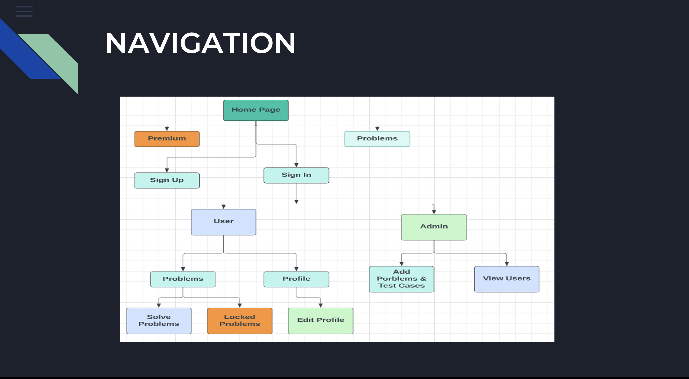
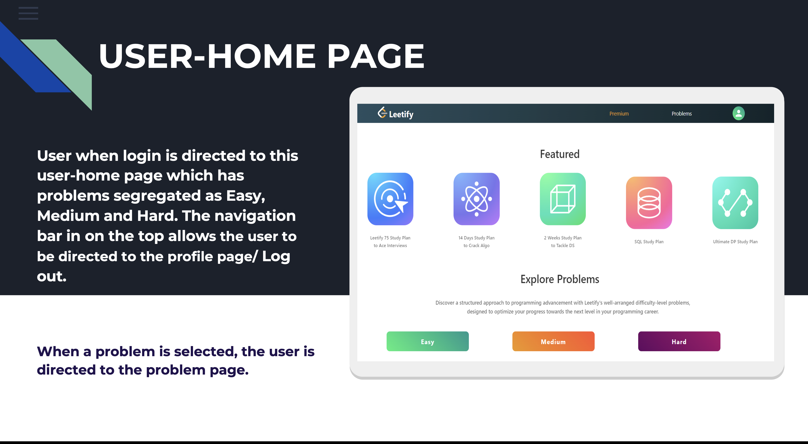
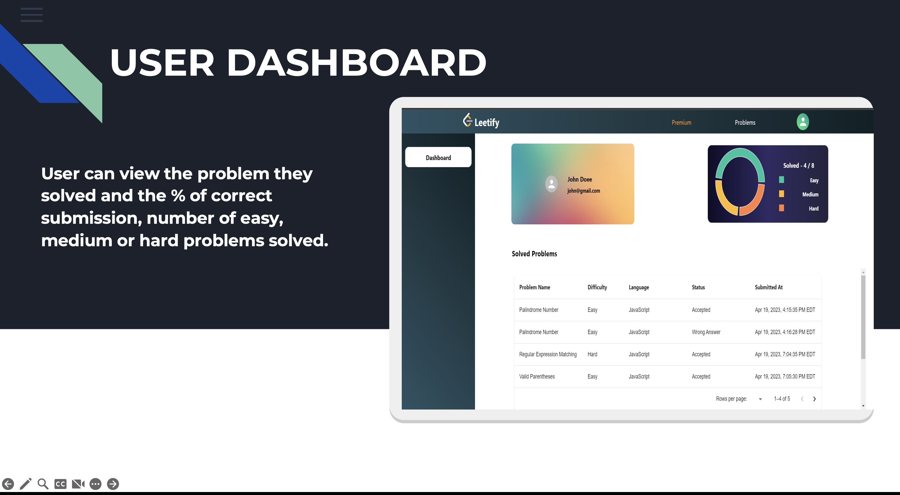
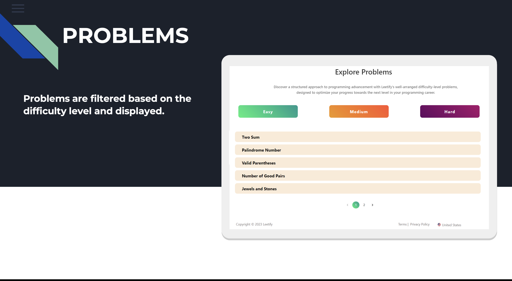
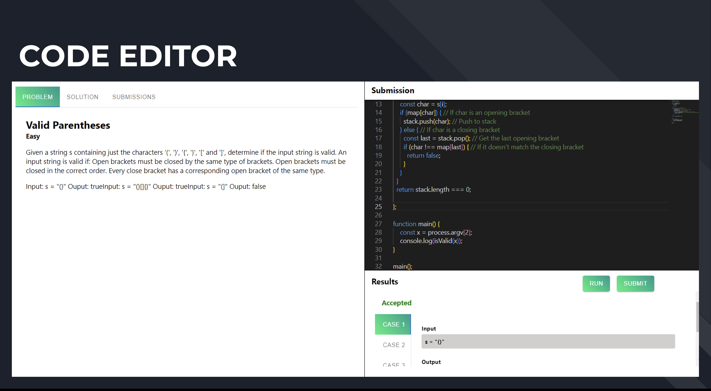
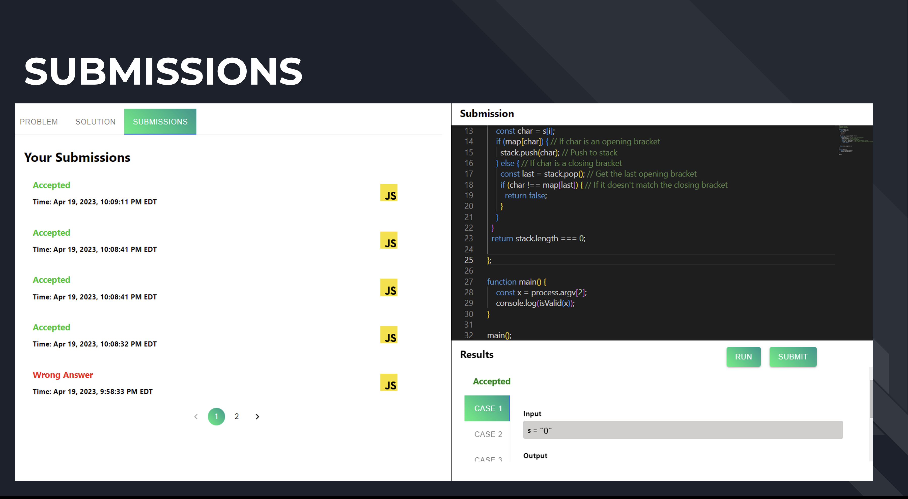
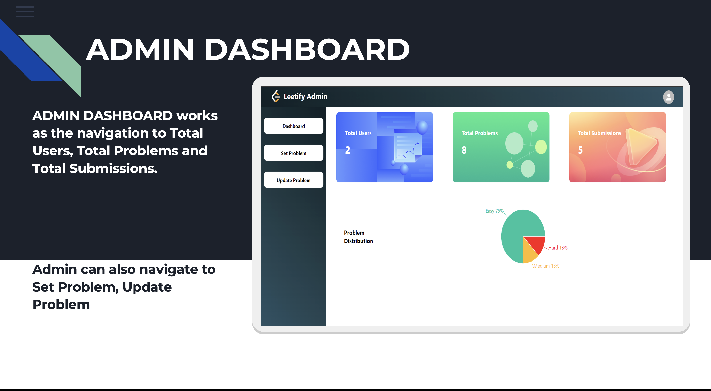
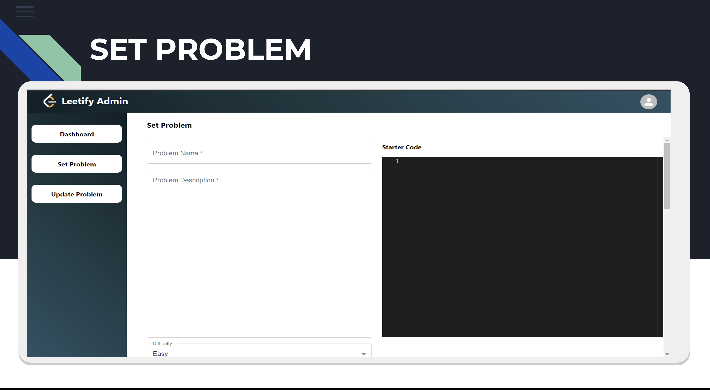
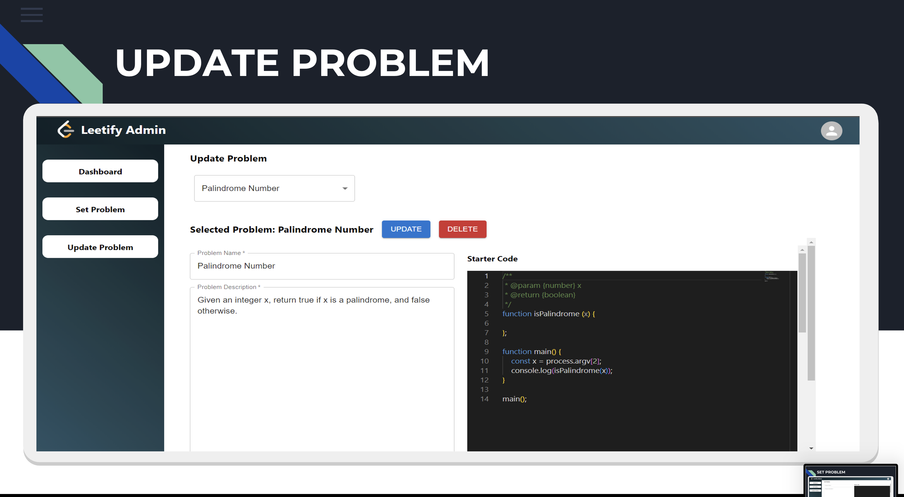

# LEETIFY 
## Project Description
Leetify is an online platform that provides a collection of coding challenges to help developers prepare for technical interviews. The platform offers a wide range of problems that cover various data structures and algorithms, such as arrays, linked lists, trees, graphs, dynamic programming, and more.
Leetify can be used by many software engineers, developers, and students who want to enhance their problem-solving and coding skills. It can also be commonly used as a tool for technical interviews, where candidates are often asked to solve coding problems similar to those found on Leetify.
There are three types of users:

-Normal User: Users who have signed up for the application can solve problems and submit their solutions.

-Premium User: Users who have upgraded to the premium plan can access additional features such as advanced analytics, and more challenging problems.

-Admin: Users with admin privileges can add new problems, view statistics, and manage users.

## Tech Stack
The project is built with the following technologies:

| **Frontend**        | **Backend**         | **UI Framework**  |
|----------------------|---------------------|-------------------|
| React, State Management (Redux)               | Node.js, Express.js            | SASS, Material UI       |

| **Charts**        | **Code Editor**         |  **Authentication** |
|----------------------|---------------------|---------------------|    
| React Recharts            | Monaco Code Editor  |JWT, BCrypt (for hashing passwords)

## Screenshots
### Homepage

### Navigation

### User Home

### User Dashboard

### Problems Page

### Code Editor

### Submissions Page

### Admin Dashboard

### Admin: Set Problem

### Admin: Update Problem

---

## System Design
### Model Diagram

